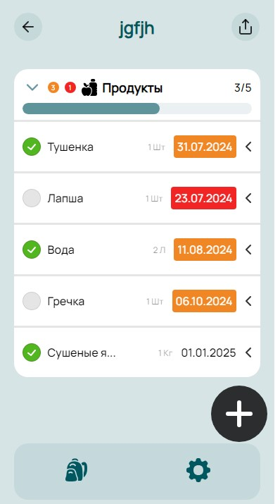
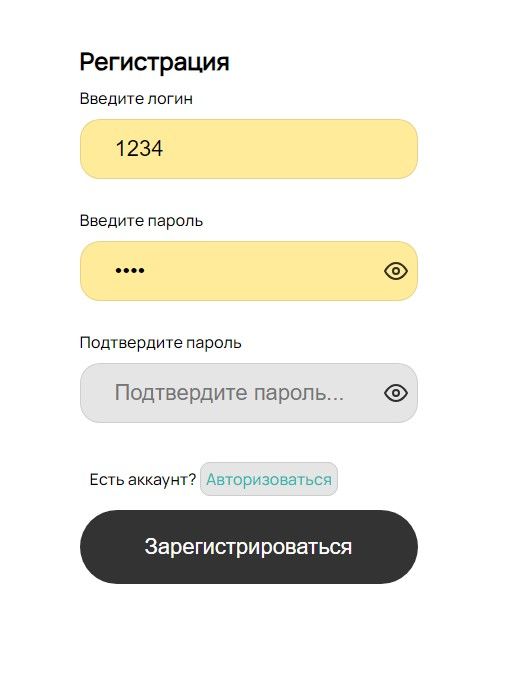
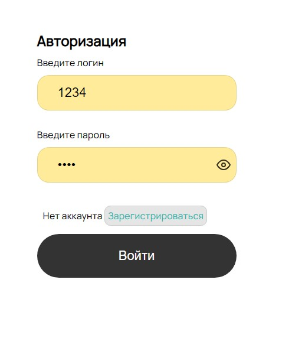

# Alarm-case

## Описание

Alarm Case - это приложение на React, которое помогает пользователям управлять своим рюкзаком. С его помощью вы можете создавать и выбирать темы рюкзака, наполнять его продуктами по категориям и отслеживать срок годности. Получайте уведомления о том, что продукты вышли из срока годности. 

## Скриншоты

## Функционал
 - Создание рюкзаков с выбором темы и назавния
 - Наполнение продуктами по категорям
 - Установка срока годности продукта и возможность визуально отслеживать, что нужно заменить если срок годности вышел
 - Возможность перемещать продукты из одной категории в другую, изменить срок годности, название, количество.
 - Визуальное отображение заполения рюкзака.

## Технологии
 - React
 - React Router
 - MobX
 - Axios
 - Express
 - Node.js
 - PostgreSQL

На данный момент выполнен деплой приложения урезанной версии без возможности авторизации и регистрации и изменения продуктов, ведется доработка функционала и переход проекта на TypeScript
